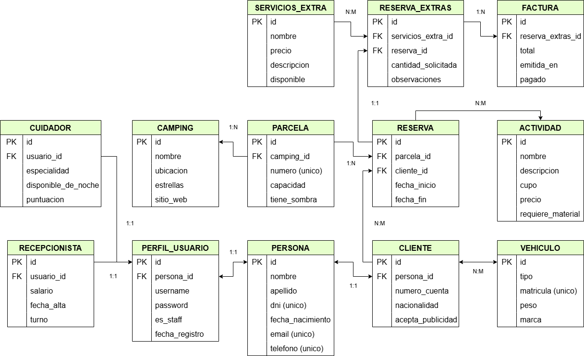

# ProyectoDWES
Este proyecto tratará sobre una página web dedicada en un sistema de gestión de campings.
Esta web permitirá administrar clientes, empleados, reservas, actividades y facturación.

## DEFINICIÓN DE LOS MODELOS
### **Persona** 
Descripción: 
Modelo base que contiene los atributos comunes para todos los usuarios del sistema (clientes, recepcionistas, cuidadores).

Atributos:
- `nombre`: Nombre de la persona.
- `apellido`: Apellido de la persona.
- `dni`: Documento Nacional de Identidad, identificador único.
- `fecha_nacimiento`: Fecha de nacimiento.
- `email`: Correo electrónico, único en la base de datos. Se utiliza el atributo EmailField que sirve para el control de estos.
- `telefono`: Número de teléfono del usuario.

### **PerfilUsuario**
Descripción: 
Perfil de usuario asociado a una persona para control de autenticación y permisos.

Atributos:
- `datos_usuario`: Relación uno a uno con Persona.
- `username`: Nombre de usuario único.
- `password`: Contraseña cifrada del usuario. Por ahora no tiene ningún control de carácteres.
- `es_staff`: Indica si el usuario pertenece a la administración. Para futuros permisos a trabajadores.
- `fecha_registro`: Fecha y hora de registro.

### **Recepcionista**
Descripción: 
Empleado de recepción en el camping.

Atributos:
- `usuario`: Usuario asignado al recepcionista.
- `salario`: Salario mensual. Con algunos controles lógicos.
- `fecha_alta`: Fecha en la que fue contratado.
- `turno`: Turno asignado (a elegir entre mañana o tarde).

### **Cuidador**
Descripción: 
Empleado encargado del cuidado de usuarios e instalaciones.

Atributos:
- `usuario`: Usuario de la web asignado al cuidador.
- `especialidad`: Área de especialización. 
- `disponible_de_noche`: Indica si está disponible por la noche.
- `puntuacion`: Valoración del cuidador de 1 a 10.

### **Cliente**
Descripción: 
Persona que utiliza los servicios del camping.

Atributos:
- `datos_cliente`: Datos personales asociados.
- `numero_cuenta`: Cuenta bancaria del cliente, puede estar en blanco (Una reserva de 5 personas, a nombre de un único cliente).
- `nacionalidad`: Nacionalidad del cliente.
- `acepta_publicidad`: Permiso para recibir publicidad.

### **Camping**
Descripción: 
Información general del camping.

Atributos:
- `nombre`: Nombre del camping.
- `ubicacion`: Dirección.
- `estrellas`: Clasificación por estrellas (1 a 5). Parámetro validators que permite únicamente los valores indicados.
- `sitio_web`: Página web oficial, opcional. Se utiliza el atributo URLField que permite agregar URLs (Aunque todos los campings se gestionen de manera "centralizada", cada uno de ellos debería tener su propia dirección web, o dentro de la misma, distintas rutas).

### **Parcela**
Descripción: 
Parcelas dentro del camping disponibles para reservar.

Atributos:
- `camping`: Camping en el que se encuentra la parcela.
- `numero`: Número identificador único de la parcela.
- `capacidad`: Capacidad máxima de personas, por defecto para 2 personas.
- `tiene_sombra`: Indica si la parcela tiene sombra (Para plus de precio).

### **Vehiculo**
Descripción: 
Vehículos registrados por los clientes.

Atributos:
- `tipo`: Tipo de vehículo, a elegir entre coche, moto o caravana.
- `matricula`: Matrícula única del vehículo.
- `peso`: Peso aproximado en kilogramos.
- `cliente`: Relación de cliente asociados.
- `marca`: Marca del vehículo, opcional.

### **Actividad**
Descripción: 
Actividades disponibles en el camping para los clientes.

Atributos:
- `nombre`: Nombre de la actividad.
- `descripcion`: Descripción detallada.
- `cupo`: Número máximo de participantes.
- `precio`: Precio por persona.
- `requiere_material`: Indica si se necesita material específico para el desarrollo de la misma.

### **Reserva**
Descripción: 
Reservas realizadas por clientes para parcelas y actividades.

Atributos:
- `cliente`: Cliente que realiza la reserva.
- `parcela`: Parcela reservada.
- `fecha_inicio`: Fecha de inicio de la reserva.
- `fecha_fin`: Fecha de finalización.
- `actividades`: Actividades reservadas.

### **ServiciosExtra**
Descripción: 
Servicios adicionales que se pueden contratar, como el desayuno, electricidad, o barbacoa.

Atributos:
- `nombre`: Nombre del servicio.
- `precio`: Precio del servicio.
- `descripcion`: Descripción opcional del servicio.
- `disponible`: Estado de disponibilidad.

### **ReservaExtra**
Descripción: 
Servicios extra asociados a una reserva.

Atributos:
- `reserva`: Reserva principal.
- `servicios_extra`: Servicio extra contratado.
- `cantidad_solicitada`: Cantidad de servicios solicitados. Por ejemplo si son 3 personas, pero solo 2 quieren desayunos, solo 2.
- `observaciones`: Observaciones opcionales.

### **Factura**
Descripción:
Facturas emitidas por servicios extra.

Atributos:
- `reserva`: Reserva extra a la que corresponde la factura.
- `total`: Importe total de la factura.
- `emitida_en`: Fecha y hora de emisión.
- `pagado`: Estado del pago.

### Parámetros Utilizados para la creación de los Modelos
- `max_length`: Limita la longitud del texto.
- `unique`: Asegura que el valor sea único y no se repita.
- `default`: Establece un valor por defecto.
- `max_digits`: Indica un numero máximo de digitos en un campo.
- `decimal_places`: Ajusta los decimales de un número.
- `choices`: Selector entre valores establecidos .
- `validators`: Permite definir reglas personalizadas en los valores de un campo.
- `blank`: Define si el campo puede estar vacío.
- `null`: Indica si el campo puede ser nulo.
- `timezone.now`: Devuelve la fecha/hora actual.
- `models.PROTECT`: Impide que se elimine el campo si está relacionado con otro registro.
- `help_text`: Nos permite agregar un texto de ayuda.

### Parámetros Utilizados para la generación de datos con Faker
- `chance_of_getting_true`: Permite indicar el porcentaje de que un boolean sea True.
- `random.randint`: Devuelve un numero entero mayor/igual y menor/igual que dos valores límite. 
- `random.uniform`: Devuelve un numero float mayor/igual y menor/igual que dos valores límite.
- `variable.{campo}.add`: Agrega (En mi caso, utilizado con v.cliente.add o re.servicios_extra.add).
- `round`: Redondea un número float, a unos decimales que se indiquen.
- `date_between_dates`: Agrega una fecha entre otras dos pasadas por parámetros.

## Creación de las URLs

### URL 1
Mostrar la información de todos los campings existentes.

Requisito/s que cumple:
- Ninguno. Prueba inicial para comprender un poco el funcionamiento.

### URL 2
Mostrar todas las reservas ordenadas por fecha de inicio. 

Requisito/s que cumple:
- Parámetro entero
- Relación OneToOne

### URL 3
Mostrar la reserva cuyo ID se recibe como parámetro.

Requisito/s que cumple:
- Parámetro entero
- Ordenación con ORDER BY
- Relación ManyToMany

### URL 4
Mostrar las facturas que tienen un coste superior o igual a 'X' y cuya parcela asociada tiene capacidad mayor o igual a 'Y'.

Requisito/s que cumple:
- Dos parámetros
- Parámetro entero
- Filtro AND
- Relación OneToMany / ManyToOne

### URL 5
Mostrar Media, Máximo y Mínimo de los precios de los servicios disponibles.

Requisito/s que cumple:
- Qset con aggregate

### URL 6
Mostrar los cuidadores con puntuación superior a la recibida O con disponibilidad durante las noches.

Requisito/s que cumple:
- Parámetro entero
- Filtro OR

### URL 7
Mostrar los servicios que incluyen una palabra en su descripción.

Requisito/s que cumple:
- Parámetro STR

### URL 8
Mostrar los clientes que no tienen vehículo asociado.

Requisito/s que cumple:
- r_path
- Filtro none con tabla intermedia

### URL 9
Mostrar las 10 primeras reservas que no tienen actividades asociadas.
El limit hará que solo se muestren X reservas (Yo voy a mostrar sólo 10)

Arreglo ya que la URL 8 no muestra datos + propiedad Limit.
Actualización: Tras cambiar algunos datos del faker si existen. Ya está hecha por lo que se queda así.

Requisito/s que cumple:
- Limit
- r_path
- Filtro none con tabla intermedia

### URL 10
Mostrar las reservas que ha hecho un cliente.

Requisito/s que cumple:
- Relación Reversa

### Parámetros Utilizados para la creación de las vistas
- `select_related`: Sirve para obtener los datos de las relaciones OneToOne, ManytoOne.
- `prefetch_related`: Sirve para obtener los datos de las relaciones ManytoMany.
- `order_by`: Nos permite ordenar los resultados de una consulta.
- `get`: Recibe cómo parámetro, la columna que desea buscar y el valor de esa columna, para obtener el registro concreto.
- `filter`: Sirve para filtrar por un campo en la base de datos, podemos usar “,” para hacer "AND".
- `Prefetch`: Permite realizar Inner Join en las relaciones inversas mediante el uso del atributo related_name.
- `__isnull=True`: Igual que el None, pero para relaciones MtM. En mi caso, la relación es MtM por lo que None no valdría, debe utilizarse 'isnull'.

### SÍMBOLOS MATEMÁTICOS DE DJANGO
- `__gt`: Nos permite buscar valores superiores al parámetro recibido (Mayor que ESTRICTO) - greater than
- `__lt`: Nos permite buscar valores inferiores al parámetro recibido (Menor que ESTRICTO) - less than
- `__gte`: Valores superiores/iguales al parámetro recibido (Mayor o igual) - greater than or equals
- `__lte`: Valores menores/iguales al parámetro recibido (Menor o igual) - greater than or equals

- `raw()`: Nos permite hacer las consultas como en SQL normal, aunque no están optimizadas.

## Template Tags
- `block/endblock`: Define un bloque usable en otra template.
- `extends`: Extiende a una clase padre desde otro archivo.
- `include`: Carga una plantilla y la representa con el contexto actual.
- `for/In`: Recorre cada elemento de una matriz, haciendo que el elemento esté disponible en una variable de contexto.
- `for/Empty`: Utilizado junto con el for/In, para establecer un escape en caso de no haber datos.
- `load`: Carga un conjunto de etiquetas de plantillas personalizadas

## Operadores
- `if (boolean)`: Condicionante que se ejecuta si el valor es True.
- `<=`: Menor o igual que.
- `>=`: Mayor o igual que.
- `>`: Mayor que.
- `is`: Indica si es la condicion (En mi caso si es True).
- `is not`: Indica si NO es la condición.

## Template Filters
- `date`: Con él podemos darle a la fecha el formato que deseemos de manera aislada.
- `upper`: Convierte un string completo a Mayúsculas. 
- `lower`: Convierte un texto a minúsculas.
- `default`: Si el valor es vacío, usa el valor por defecto.
- `floatformat`: Formatea números decimales a un número fijo de decimales.
- `capfirst`: Convierte a mayúscula la primera letra de la secuencia.
- `urlize`: Convierte el texto dentro de HTML a URL.
- `title`: Convierte la primera letra de todas las palabras de la cadena a mayúscula. 
- `add`: Suma un número al valor.
- `yesno`: Convierte valores booleanos a textos personalizados (Si/No).

## Usos de los parámetros poco utilizados (no voy a poner dónde utilizo los template tags porque se utilizan en muchos lugares, prácticamente en todos los archivos).
### if booleano
En el archivo reserva_por_id se utiliza un if booleano para comprobar que esa reserva tiene actividades, de lo contrario saltar rápido al escape.

### >= | <=
En el archivo facturas.html, para clasificar la factura según el precio.

### > 
En cuidadores.html, para indicar los que tienen una muy buena puntuación.

### is / is not
En el archivo facturas.html, para indicar el estado del pago es True o False, según el estado (ambos usan True como condición, ya que is True, indica que si está pagado, y is not True, que no)

### date
Utilizado en los modelos con atributos date o dateTime para dar formato.

### upper
Utilizado para el nombre de los clientes.

### lower
En actividades, para mostrar la descripción completa en minúsculas.

### default
En clientes, para indicar una nacionalidad por defecto en caso de no encontrarse (o pérdida del registro).

### floatformat
En servicios_media_puntos, para limitar los decimales de cada parámetro.

### capfirst
En las fechas, para que la primera letra del día salga en mayúsculas.

### urlize
En campings, para la URL de cada camping, en lugar de utilizar una etiqueta HTML '<a>', utilizo el filtro.

### title
En servicios, para poner como título el nombre de cada servicio.

### add
En actividades, para agregar capacidad a cada actividad.

### yesno
En las facturas, para indicar si una parcela tiene sombra (True), o no (False).

### La rama 4 (CRUD-4) la he creado, pero no me he dado cuenta y no me he cambiado a ella. He hecho el crud completo y cuando he ido a hacer el commit me he dado cuenta que estaba en el main. Las otras sí están bien hechas (auqnue hay algunos cambios entre ellas)

## WIDGETS
- `EmailField()`: En el modelo Persona, para el campo del email.
- `DateInput`: En PersonaModelForm (fecha_nacimiento), RecepcionistaModelForm (fecha_alta), FacturaModelForm (emitida_en) y formularios de búsqueda. Renderiza el tipo date con formato "%Y-%m-%d.
- `PasswordInput`: En PerfilUsuarioModelForm y PerfilUsuarioUpdateForm para password, oculta los caracteres introducidos por seguridad.
- `CheckboxInput`: En múltiples formularios (es_staff, tiene_sombra, pagado), genera checkboxes para campos booleanos con clases Bootstrap.
- `Select`: En PerfilUsuarioModelForm (rol), RecepcionistaModelForm (turno), ParcelaModelForm (camping), FacturaModelForm (reserva_extra), muestra opciones desplegables.
- `NumberInput`: En RecepcionistaModelForm (salario), CampingModelForm (estrellas), ParcelaModelForm (numero, capacidad), FacturaModelForm (total), inputs numéricos con min/max.​
- `URLInput`: En CampingModelForm para sitio_web, valida automáticamente formato URL con placeholder HTTPS.​
- `CheckboxSelectMultiple`: En formularios de búsqueda (rolBusqueda, turno), permite selección múltiple de opciones como checkboxes.​
- `MultipleChoiceField`: En BusquedaPerfilesUsuariosForm (rolBusqueda) y BusquedaRecepcionistasForm (turno), selección múltiple de opciones predefinidas con CheckboxSelectMultiple.
- `NullBooleanField`: En BusquedaParcelasForm (tiene_sombra) y BusquedaFacturasForm (pagado), maneja valores booleanos que pueden ser nulos (True/False/None).

- También está integrado el ClearableFileInput, que estaba en proceso para la imagen de foto de perfil, pero no he conseguido ponerlo bien.

- `def init`: Lo he utilizado en el form modelo perfilUsuario, porque quería que no saliesen todas las personas, sino solo las que no tengan ya perfil de usuario creado (las disponibles). 
Para los otros modelos no lo he vuelto a incluir, ya que he estado bastante peleandome con chatgpt en ese apartado específico porque no lo entendía del todo bien, cuando vaya sin prisa me pondré a probar cosas con él ya que según he entendido, es para setear valores al principio del formulario.

## SESIONES Y AUTENTICACIÓN
Hay 4 tipos de usuarios (Roles definidos en el modelo Usuario):
1. **Administrador**: Acceso total al panel de administración y gestión.
2. **Recepcionista**: Puede gestionar reservas, clientes y facturas.
3. **Cuidador**: Personal encargado del mantenimiento o actividades.
4. **Cliente**: Puede ver y crear sus propias reservas.

### Funcionalidades Implementadas por Requisito
- **Control de Permisos**:
  - En Vistas: Uso de decoradores `@login_required` y lógica condicional según el rol del usuario (ej: filtrado de reservas).
  - En Templates: Ocultación de botones (Crear/Editar/Eliminar) si el usuario no está autenticado.

- **Variables de Sesión**:
  - Se visualizan 4 variables en la cabecera al estar logueado: Rol, Email, Fecha de Inicio de Sesión y ID de sesión.

- **Formularios Dinámicos**:
  - `Crear Reserva`: El campo 'Cliente' varía. Si es un Cliente logueado, se auto-selecciona y oculta/bloquea. Si es Recepcionista, puede elegir cualquier cliente.

- **Búsqueda Filtrada**:
 - El listado de reservas muestra solo las reservas del usuario si es Cliente. Muestra todas si es personal del camping.

- **Recuperación de Contraseña**:
- Funcionalidad completa de "Olvidé mi contraseña" implementada (visible en consola local).

### EXTRAS
- `dict()`: Convierte datos clave-valor en un diccionario. De esta forma, como en el form se muestra el valor del choices, al compararlo con la tupla en la validación, daría error, pero como está en el diccionario completo ('ma':'Mañana') si lo encuentra y no salta el error.

- `EMAIL_BACKEND`: En settings, hace que el correo de recuperar contraseña, en lugar de enviarse al correo, se haga por terminal, ya que al ser un proyecto local, fallaría.

- Archivo signals.py: Guarda variables de sesión en toda la web, sin necesidad de estar llamando a la base de datos constantemente. Funciona junto con el contenido agregado en el archivo archivo apps.py.

- En cuanto a las vistas de cambio de contraseña, he creado nuevas urls para que no saliera el error de que no se encontraba el template, ya que django por defecto usa otros nombres para los archivos y yo he utilizado otros (con estos lo entiendo mejor), también por supuesto las plantillas asociadas.
 
- `autoescape`: En la template del email para el cambio de contraseña, son etiquetas de bloque que indican si los carácteres especiales deben tratarse como texto plano o no. En este casi sí ya que se utiliza 'off'

- Para el tema de permisos he estado mirando y, aunque no he utilizado nada finalmente (sí el como está en las diapositivas), he dejado por ahí código comentado que no se ejecuta pero me puede servir para cuando tenga más tiempo poder revisarlo y ver cosas nuevas.

## DIAGRAMA DE CLASES

